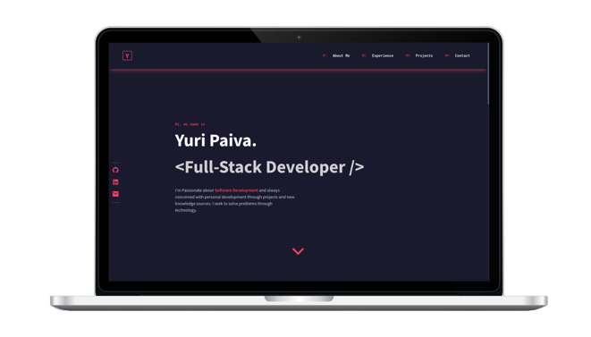

# Portfolio &middot;   

<div align="center">
  
</div>

<br>

## 💡 Introduction

Personal Portfolio Web application:

1. About me
2. Experience
3. Projects
4. Contact

<br>

## 🧪 Technologies and Services

- [React](https://reactjs.org)
- [ChakraUI](https://chakra-ui.com/)
- [GraphQL](https://graphql.org/)
- [Apollo](https://chakra-ui.com/)

<br>

## 🖥 Pre-requisites:

- NodeJS
- Yarn

<br/>

## 🚀 How to Run it?

From project's root file:

```sh
$ yarn install
$ yarn dev
```

<br>

## 📝 License

MIT License © Yuri Paiva. Check [LICENSE](LICENSE) for more details

---

<br>

Made with 💜 &nbsp;by Yuri Paiva
